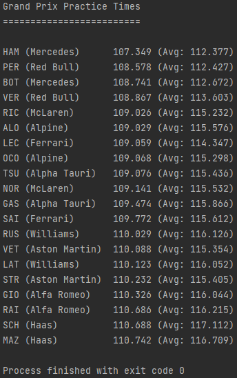

# Assessment

## **Table of Contents**

* [**Task 1**](#task_1)
* [**Task 2**]
### Task 1
In this task, program will ask the user enter the password which should be more than 8 characters. 

Then, the user will be asked 3 times for the specific index of the password they put.

Outcome of the program will be like below in positive scenario. 

 

    <b><a href="#table-of-contents">↥ Back to top</a></b>

 

### Task 2

In the second task, the user will be asked to enter driver's name and driver's time which will be in strict format, first 3 characters representing driver's name and the rest have to be number which can be decimal, as well.

Then, the program will calculate the number of different drivers entered and will create a table illustrating number of laps, the fastest time, the slowest time, and the mean time amongst whole laps for each driver.

Result of the program will appear as below

 

    <b><a href="#table-of-contents">↥ Back to top</a></b>

 

### Task 3

In the third program, the user will be asked to load the file first and it will trigger another python file which generates ips, uris, and status codes which shows whether ip accessed to uri successfully or not.

Then, the program can show basic statistics, and can summarise HTTP codes which shows the ratio of status code received in the log file.

Outcome of the third task will be seen as below

 

    <b><a href="#table-of-contents">↥ Back to top</a></b>

 

### Task 4

In the last task, the result of race will be ordered based on the fastest lap which each player has finished and also show the average of laps for each driver. The data will be taking from lap_time txt file. 

Result of the program will be like below

 

    <b><a href="#table-of-contents">↥ Back to top</a></b>

 